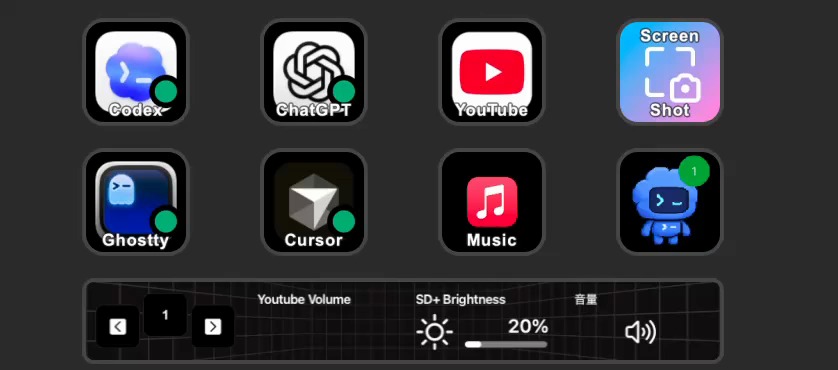

# Codex Pet Stream Deck

Display the Codex app pet on an Elgato Stream Deck key.

The default path renders frames locally from Codex-compatible pet spritesheets
and best-effort Codex activity state. The Stream Deck plugin reads those frames
through a small data URL/status contract and displays them with `setImage`.

The original macOS overlay capture path is still available as an explicit
fallback for experiments that need pixel-level mirroring of the rendered Codex
overlay.

## Demo

[](docs/assets/demo.mp4)

## Status

This is usable as a local preview, but it is not packaged as a polished public release yet.

- Works on macOS with the Codex desktop app and Elgato Stream Deck.
- Uses a native Swift helper for local pet rendering.
- Uses a Stream Deck SDK plugin for display.
- Defaults to `10fps` in asset-renderer mode so the Stream Deck samples Codex's shortest pet animation frames closely. The Stream Deck plugin reads the helper's `status.json` and automatically adjusts its polling interval to the configured FPS.
- Does not require macOS Screen Recording permission in the default `render-assets` mode.
- Can follow Codex's exact live avatar frame and notification badge when Codex is launched with an Electron remote debugging port.
- Can still use the old CoreGraphics capture path with `HELPER_MODE="capture-overlay"` when needed.

The asset renderer migration plan is documented in
[Asset renderer migration](docs/asset-renderer-migration.md).

## Requirements

- macOS 14 or newer.
- Swift 6 toolchain.
- Codex desktop app.
- Elgato Stream Deck app 6.5 or newer.
- A Codex-compatible custom pet under `~/.codex/pets/<pet-id>` for the current default renderer.
- macOS Screen Recording permission only if you enable the `capture-overlay` fallback.
- Optional: Codex launched with `--remote-debugging-port=9222` for exact live frame and notification badge sync.

## Build From Source

From the repository root:

```sh
./scripts/install.sh
./scripts/start-helper.sh
./scripts/dev/open-menubar.sh
```

`install.sh` builds the Swift app bundles, symlinks the Stream Deck plugin into Stream Deck's plugin folder, creates the user LaunchAgent, and writes the default config file. Keep the repository in a stable path after installing because the LaunchAgent points back to this checkout.

Then restart the Stream Deck app and add `Codex > Live Pet` to a key. The menu bar controller can start, stop, restart, tune crop, and inspect the helper without returning to a terminal.

Expected local artifacts:

```text
dist/Codex Pet Capture.app
dist/Codex Pet.app
~/Library/LaunchAgents/com.kousw.codex-pet-capture.plist
~/Library/Application Support/Codex Pet StreamDeck/config.env
~/Library/Application Support/com.elgato.StreamDeck/Plugins/com.kousw.codex-pet.sdPlugin
```

To verify capture before debugging Stream Deck, run:

```sh
./scripts/status.sh
open streamdeck-plugin/com.kousw.codex-pet.sdPlugin/frames/latest.png
```

If `status.sh` reports `status: "ok"` and `latest.png` shows the pet, the capture helper is working. If the Stream Deck key still does not update, remove and re-add the `Live Pet` action and restart the Stream Deck app.

Default `render-assets` mode does not need Screen Recording permission. The old
`capture-overlay` path is kept as a legacy fallback for development and visual
comparison. If you switch to that mode and macOS blocks capture, open:

```text
System Settings > Privacy & Security > Screen & System Audio Recording
```

Grant access to the helper process if it appears there. If you are running the
helper manually from Terminal, Ghostty, iTerm, Warp, or another shell, grant
access to that shell app and restart it if macOS asks.

For the fallback installed path, grant access to `Codex Pet Capture`. It is generated under `dist/Codex Pet Capture.app` so macOS can show it as an app in the Screen Recording permission list.

If `status.sh` still reports `screen-recording-denied` after granting access,
reset the TCC entry for the capture helper:

```sh
./scripts/stop-helper.sh
tccutil reset ScreenCapture com.kousw.codex-pet-capture
```

Then enable `Codex Pet Capture` again in Screen Recording settings and restart
the helper.

When only the menu bar UI changed, build just that app:

```sh
./scripts/dev/build-apps.sh --menubar-only
```

Use the full build only when the capture helper changed:

```sh
./scripts/dev/build-apps.sh
```

## Manual Test

Run the default asset renderer directly for a short test:

```sh
cd capture-macos
swift run codex-pet-capture \
  --render-assets \
  --pet-id <pet-id> \
  --pet-state idle \
  --fps 10 \
  --duration 3 \
  --output-dir ../streamdeck-plugin/com.kousw.codex-pet.sdPlugin/frames
```

The generated frame should appear at:

```text
streamdeck-plugin/com.kousw.codex-pet.sdPlugin/frames/latest.png
```

The status file should report `source: "asset-renderer"`.

### Capture Fallback Test

Run the old capture helper directly for a short test:

```sh
cd capture-macos
swift run codex-pet-capture \
  --serve \
  --frame-mode pet \
  --capture-engine core-graphics \
  --fps 1 \
  --duration 10 \
  --output-dir ../streamdeck-plugin/com.kousw.codex-pet.sdPlugin/frames
```

The generated frame should appear at:

```text
streamdeck-plugin/com.kousw.codex-pet.sdPlugin/frames/latest.png
```

## Helper Control

```sh
./scripts/start-helper.sh
./scripts/stop-helper.sh
./scripts/status.sh
./scripts/dev/open-menubar.sh
./scripts/set-fps.sh 10
./scripts/set-debug.sh 1
./scripts/dev/clean-artifacts.sh
./scripts/uninstall.sh
```

`status.sh` prints the LaunchAgent state, the latest frame status, and recent helper errors.

Frame FPS is configurable. The default is `10` for the asset renderer because Codex's pet animation has frames as short as `110ms`. For lower CPU or more conservative Stream Deck behavior, reduce it:

```sh
./scripts/set-fps.sh 5
./scripts/stop-helper.sh
./scripts/start-helper.sh
```

The helper clamps fps to `1...15`.

The asset renderer follows Codex's local avatar timing: `running`, `waiting`,
`failed`, and `review` play their state row three times, then fall back to the
slow idle loop until the state changes again. At very low FPS, some short frames
will be skipped even though the timeline is correct.

## Exact Live Sync

By default, the helper infers Codex activity from local state and session logs.
That keeps the default path permission-free, but it is best-effort and can differ
from the Codex overlay's exact transient motion.

For closer live sync, launch Codex with Electron remote debugging enabled:

```sh
./scripts/exact-sync/open-codex-debug.sh
curl http://127.0.0.1:9222/json/version
```

Then start the avatar sync bridge:

```sh
./scripts/exact-sync/start-avatar-sync.sh 9222
./scripts/stop-helper.sh
./scripts/start-helper.sh
```

The bridge reads the live overlay's `.codex-avatar-root` `background-position`
through DevTools and writes the current sprite row/column to:

```text
~/.codex/pet-streamdeck-state.json
```

When active, `status.json` reports:

```json
{
  "stateSource": "codex-debug-overlay",
  "notificationBadgeCount": 1
}
```

In this mode, the helper renders the same sprite row/column as the Codex overlay
and draws the small notification badge when the overlay exposes one.

Limitations:

- Codex must be launched with `--remote-debugging-port`; a normal Dock launch does not expose the live overlay DOM.
- macOS Dock items cannot attach arbitrary launch arguments to an existing `.app`, so use `./scripts/exact-sync/open-codex-debug.sh` or an external launcher if you want debug-port startup.
- The DevTools bridge is local-only and talks to `127.0.0.1`, but remote debugging should still be treated as a development feature.
- If the bridge stops or Codex restarts without the debug port, the helper falls back to the best-effort local state/session renderer.

The menu bar controller appears as `Codex Pet` in the macOS menu bar. It provides:

- helper start, stop, and restart
- latest frame status
- capture FPS presets
- quick access to the frames and Stream Deck plugin folders
- quick access to the config file
- a best-effort `codex://` launcher

The installed config lives at:

```text
~/Library/Application Support/Codex Pet StreamDeck/config.env
```

Supported settings:

```sh
FPS="10"
RETRY_INTERVAL="2"
HELPER_MODE="render-assets"
DEBUG="0"
PET_ID=""
PET_STATE=""
FRAME_MODE="pet"
CAPTURE_ENGINE="core-graphics"
CROP_X="248"
CROP_Y="222"
CROP_WIDTH="89"
CROP_HEIGHT="89"
```

`FPS` is clamped to `1...15`. `HELPER_MODE` supports `render-assets` and
`capture-overlay`. `PET_ID` and `PET_STATE` are optional renderer overrides;
leave them empty for best-effort auto detection. `PET_STATE` may be `idle`,
`running`, `waiting`, `failed`, or `review`.

Set `DEBUG="1"` to keep per-frame helper logs in
`~/Library/Logs/codex-pet-streamdeck/helper.log`. Leave it off for normal use,
especially at `10fps`.

The menu bar app can update FPS, then restarts the helper so the change takes
effect. Legacy `capture-overlay` crop controls remain in the menu bar app for
development, but there are no top-level helper scripts for them.

## Troubleshooting

If the Stream Deck key does not change, remove and re-add the `Live Pet` action. Stream Deck may ignore plugin `setImage` calls when the key has a user-customized image.

If frames stop updating, run:

```sh
./scripts/status.sh
```

Common causes are missing custom pet assets, stale status output, or the Stream Deck app needing a restart after plugin changes. In `capture-overlay` fallback mode, missing Screen Recording permission or a hidden Codex overlay can also stop updates.

If the pet is visible in `latest.png` but not on the key, the capture helper is working and the issue is likely in the Stream Deck plugin/runtime side.

## Project Layout

- `capture-macos/`: native Swift capture helper.
- `streamdeck-plugin/`: Stream Deck plugin.
- `shared/`: frame/status contract.
- `docs/`: research, architecture, and release notes.

## Docs

- [Research notes](docs/research.md)
- [Architecture](docs/architecture.md)
- [Asset renderer migration](docs/asset-renderer-migration.md)
- [Public readiness](docs/public-readiness.md)
- [Security review](docs/security-review.md)
