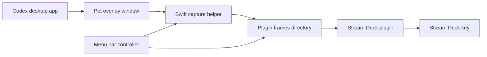

# Public Readiness

This document tracks the gap between the current local preview and a project that can be comfortably published for other users.

## Current Architecture

The capture helper runs as a user LaunchAgent and writes frames into the plugin bundle. The Stream Deck plugin reads `latest-data-url.txt` and sends it to the key with `setImage`. It also reads `status.json` and adjusts its polling interval from `captureFPS`, so helper FPS and plugin refresh stay aligned.

The menu bar controller is a small AppKit utility that controls the helper LaunchAgent and reads `status.json`. It is intentionally separate from the Stream Deck plugin because plugin code runs inside the Stream Deck app runtime and is not a good place for system service control.

## Why This Shape

The Codex pet is already rendered by Codex, including animation, state, badge, and any future visual changes. Mirroring the overlay preserves that behavior instead of trying to reimplement Codex's pet animation state machine.

The Stream Deck SDK does not reliably play a live animated source through one static image assignment. The plugin therefore sends updated still frames. In practice, one update per second is the stable default, while `5fps` is useful for local testing.

The helper uses CoreGraphics window snapshots for steady capture. ScreenCaptureKit is the better long-term API, but repeated one-shot `SCScreenshotManager` captures were unstable during testing. A real `SCStream` implementation is the right future replacement.

## Public Release Gaps

- Packaging: ship signed `.app` bundles and a Stream Deck plugin bundle instead of asking users to build with Swift.
- Permissions: `Codex Pet Capture.app` exists so macOS can show a stable app in Screen Recording settings. This still needs signing/notarization for a polished public release.
- Capture API: replace repeated CoreGraphics snapshots with an `SCStream` window capture path once implemented and tested.
- Plugin transport: move from file polling to a push channel if higher frame rates are required.
- Foreground action: `codex://` can launch Codex, but did not reliably bring the app to the front in testing.
- Configuration UI: the menu bar app now exposes FPS presets and crop nudges. A Stream Deck property inspector can still be added later for users who expect all settings inside Stream Deck.
- Menu bar packaging: the controller is generated as a simple `LSUIElement` `.app`; a polished release should sign and notarize it.
- Release automation: add a build script that creates a `.streamDeckPlugin` artifact and a helper distribution package.

## Performance Guidance

Start with `1fps`. This keeps CPU usage low, avoids excessive file churn, and matches observed Stream Deck runtime behavior.

Avoid enabling high frame rates by default. Higher capture rates increase window snapshot cost and may not produce visible Stream Deck updates because plugin rendering can be throttled or coalesced.

The current frame is `144x144` PNG encoded as a data URL. The helper writes it atomically and the plugin skips duplicate image payloads per key. If the project later needs smoother animation, replace polling with a direct push transport and measure Stream Deck update behavior before raising defaults.

## Local Release Checklist

- `swift build -c release --package-path capture-macos` succeeds.
- `./scripts/install.sh` installs the plugin symlink and LaunchAgent.
- `./scripts/start-helper.sh` starts the helper.
- `frames/status.json` reports `status: "ok"` while Codex pet is visible.
- `frames/latest.png` shows the cropped pet.
- Stream Deck `Codex > Live Pet` displays the same frame.
- `./scripts/stop-helper.sh` stops the helper cleanly.
- `./scripts/uninstall.sh` removes the LaunchAgent and plugin symlink.
