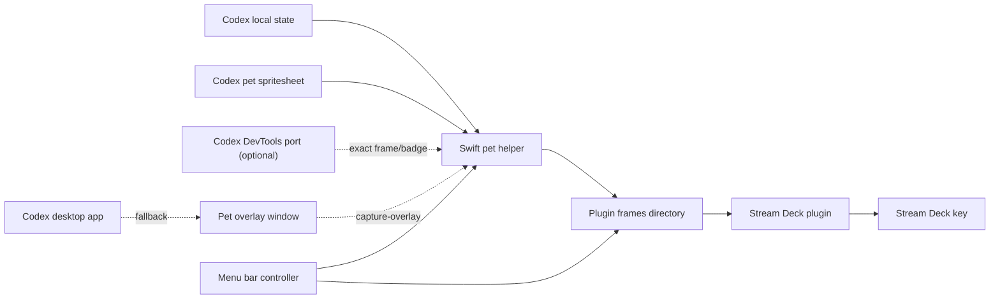

# Public Readiness

This document tracks the gap between the current local preview and a project that can be comfortably published for other users.

## Current Architecture

The helper runs as a user LaunchAgent and writes frames into the plugin bundle.
The default mode renders frames from Codex pet spritesheets and best-effort
local state. If Codex is launched with an Electron remote debugging port, an
optional local Node bridge can read the live overlay sprite row/column and
notification badge count so the helper follows the exact visible motion. The
Stream Deck plugin reads `latest-data-url.txt` and sends it to the key with
`setImage`. It also reads `status.json` and adjusts its polling interval from
`captureFPS`/`renderFPS`, so helper FPS and plugin refresh stay aligned.

The menu bar controller is a small AppKit utility that controls the helper LaunchAgent and reads `status.json`. It is intentionally separate from the Stream Deck plugin because plugin code runs inside the Stream Deck app runtime and is not a good place for system service control.

## Why This Shape

The original prototype mirrored the Codex overlay to preserve exact rendered
behavior. The default path now favors local asset rendering because it avoids
Screen Recording permission, crop tuning, and overlay position drift.

The Stream Deck SDK does not reliably play a live animated source through one static image assignment. The plugin therefore sends updated still frames. In asset-renderer mode, `10fps` is the fidelity default because Codex's shortest avatar frame is `110ms`; users can lower it if hardware or battery cost matters more than motion fidelity.

The helper still keeps a CoreGraphics capture fallback for pixel-level overlay
mirroring. ScreenCaptureKit is the better capture API, but repeated one-shot
`SCScreenshotManager` captures were unstable during testing. A real `SCStream`
implementation is the right future fallback if exact overlay mirroring remains
important.

## Public Release Gaps

- Packaging: ship signed `.app` bundles and a Stream Deck plugin bundle instead of asking users to build with Swift.
- Permissions: default rendering does not need Screen Recording. The fallback `Codex Pet Capture.app` still exists so macOS can show a stable app in Screen Recording settings when capture is enabled.
- Capture API: keep repeated CoreGraphics snapshots as a fallback or replace them with an `SCStream` window capture path once implemented and tested.
- Plugin transport: move from file polling to a push channel if higher frame rates are required.
- Foreground action: `codex://` can launch Codex, but did not reliably bring the app to the front in testing.
- Configuration UI: the menu bar app now exposes FPS presets and crop nudges. A Stream Deck property inspector can still be added later for users who expect all settings inside Stream Deck.
- Exact sync UX: exact live motion requires launching Codex with `--remote-debugging-port` and running `start-avatar-sync.sh`; this is documented but not polished for non-developer users.
- Menu bar packaging: the controller is generated as a simple `LSUIElement` `.app`; a polished release should sign and notarize it.
- Release automation: add a build script that creates a `.streamDeckPlugin` artifact and a helper distribution package.

## Performance Guidance

Start with `10fps` in asset-renderer mode. The work is local spritesheet cropping and PNG encoding, and the plugin skips duplicate payloads. Lower to `5fps` or `1fps` if the Stream Deck runtime coalesces updates or if minimal file churn matters more than matching Codex's animation timing.

Avoid enabling high capture fallback rates by default. Higher capture fallback rates increase window snapshot cost, and may not produce visible Stream Deck updates because plugin rendering can be throttled or coalesced.

The current frame is `144x144` PNG encoded as a data URL. The helper writes it atomically and the plugin skips duplicate image payloads per key. If the project later needs smoother animation, replace polling with a direct push transport and measure Stream Deck update behavior before raising defaults.

## Local Release Checklist

- `swift build -c release --package-path capture-macos` succeeds.
- `codex-pet-capture --render-assets --duration 3` writes `source: "asset-renderer"` status.
- `./scripts/install.sh` installs the plugin symlink and LaunchAgent.
- `./scripts/start-helper.sh` starts the helper.
- `frames/status.json` reports `status: "ok"` with `source: "asset-renderer"`.
- `frames/latest.png` shows the rendered pet.
- Stream Deck `Codex > Live Pet` displays the same frame.
- `./scripts/stop-helper.sh` stops the helper cleanly.
- `./scripts/uninstall.sh` removes the LaunchAgent and plugin symlink.
